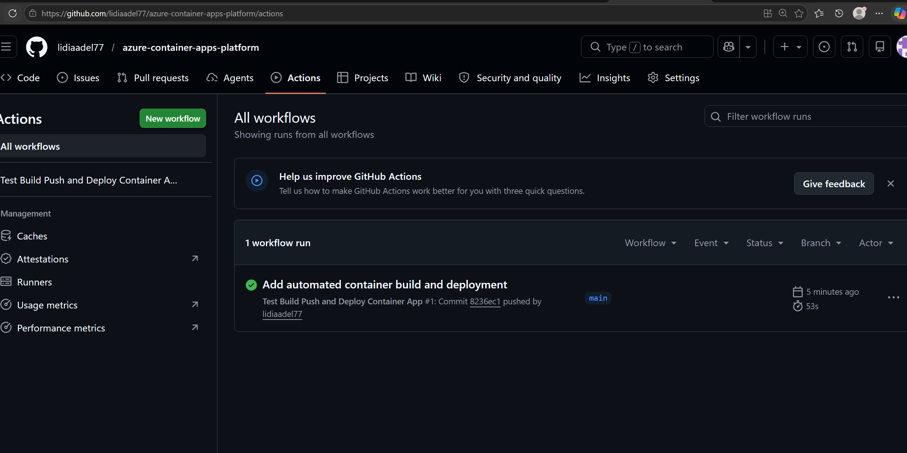
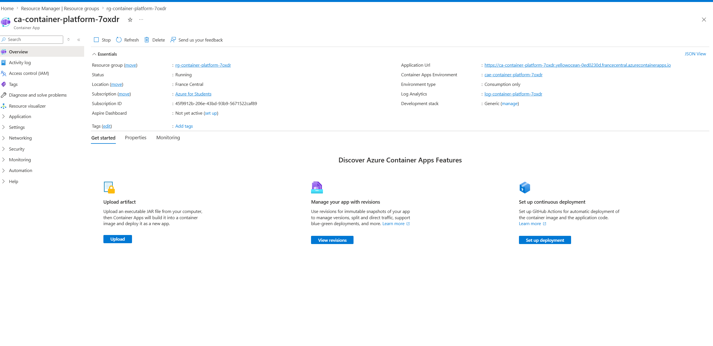
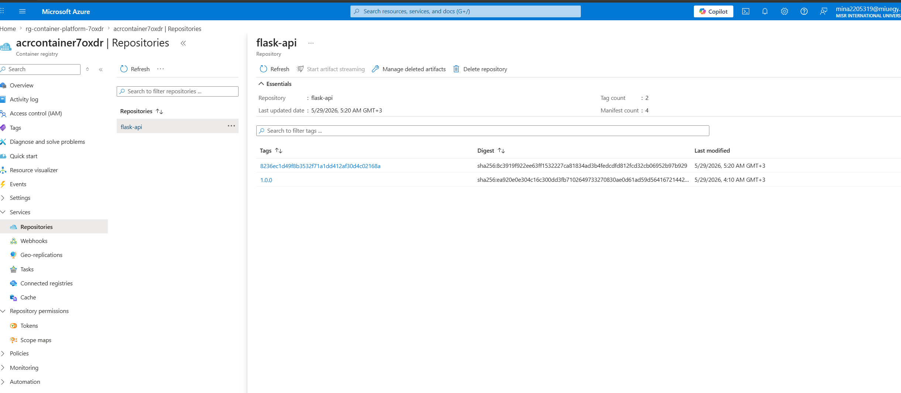
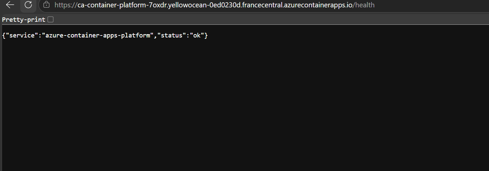
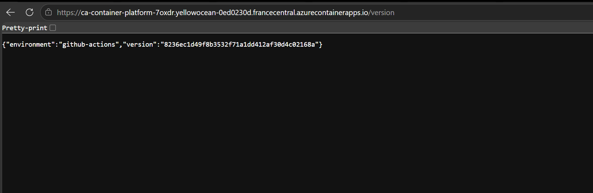

# Azure Container Apps Platform

## Overview

This project is a cloud-native Azure container deployment platform.

It demonstrates how to containerize a Python Flask application using Docker, store the image in Azure Container Registry, deploy it to Azure Container Apps, and automate the full build and deployment process using GitHub Actions.

## Architecture

The project follows this flow:

Flask App → Docker Image → Azure Container Registry → Azure Container Apps → GitHub Actions CI/CD

## Tools and Services Used

- Python Flask
- Pytest
- Docker
- Azure Container Registry
- Azure Container Apps
- Azure Managed Identity
- Azure Log Analytics
- Terraform
- GitHub Actions
- Azure CLI

## Features Implemented

- Flask API with `/`, `/health`, and `/version` endpoints
- Local Pytest test suite
- Dockerfile for containerizing the app
- Local Docker image build and container test
- Azure Container Registry for storing Docker images
- Azure Container Apps for hosting the container
- Managed Identity with ACR Pull permission
- Terraform infrastructure provisioning
- GitHub Actions workflow for automated test, build, push, and deploy
- Log Analytics integration for monitoring

## Live Application

Container App URL:

https://ca-container-platform-7oxdr.yellowocean-0ed0230d.francecentral.azurecontainerapps.io

Health endpoint:

https://ca-container-platform-7oxdr.yellowocean-0ed0230d.francecentral.azurecontainerapps.io/health

Version endpoint:

https://ca-container-platform-7oxdr.yellowocean-0ed0230d.francecentral.azurecontainerapps.io/version

## CI/CD Pipeline

The GitHub Actions workflow performs:

1. Checkout repository
2. Set up Python
3. Install dependencies
4. Run Pytest tests
5. Login to Azure using OIDC
6. Login to Azure Container Registry
7. Build Docker image
8. Push Docker image to ACR
9. Update Azure Container Apps with the new image

## Screenshots

### GitHub Actions Deployment Success

### Container App Overview

### Azure Container Registry

### ACR Flask Image Tags

### Container App Health Endpoint

### Container App Version Endpoint

## Documentation

Detailed setup notes are available in:

`docs/setup-steps.md`

Docker notes are available in:

`docs/docker-notes.md`

## Key Learning Outcomes

This project demonstrates:

- Docker containerization
- Azure Container Registry usage
- Azure Container Apps deployment
- Managed Identity access to ACR
- Terraform Infrastructure as Code
- GitHub Actions CI/CD automation
- OIDC-based Azure authentication
- Cloud-native application deployment

## Project Status

Completed initial production-style version.

Future improvements:

- Add staging and production environments
- Add custom domain
- Add autoscaling rules
- Add container health probes
- Add alerts and dashboards
